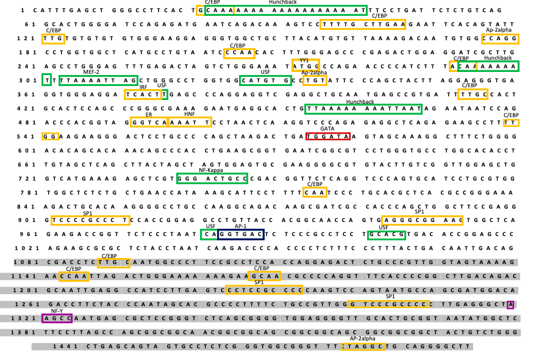
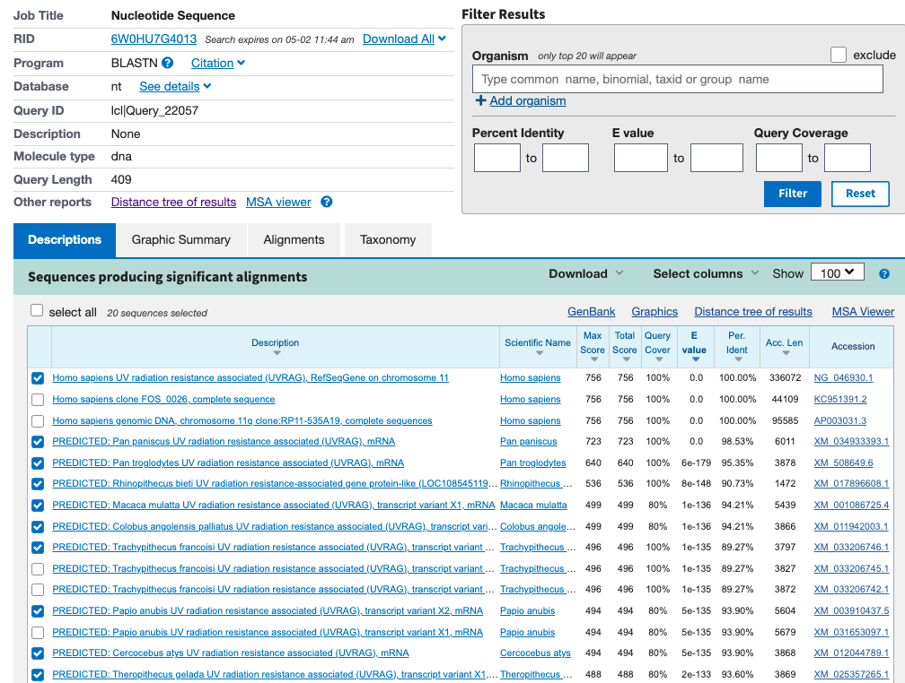
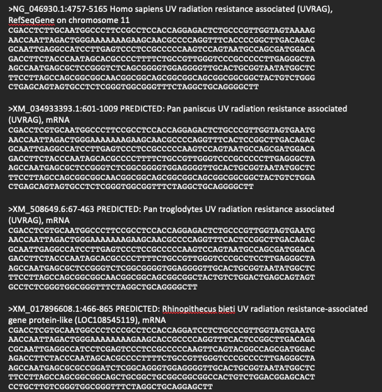
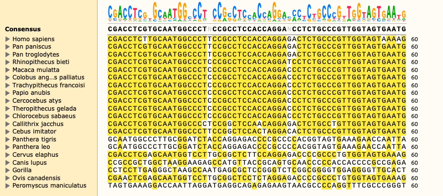
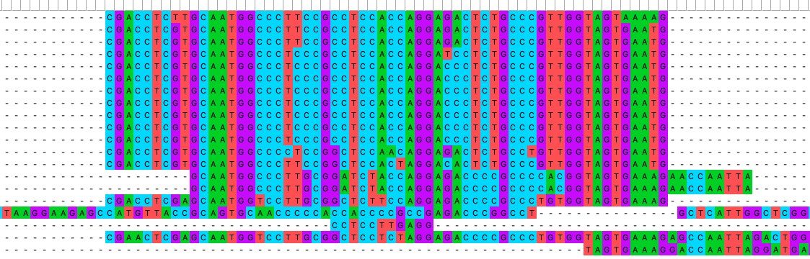
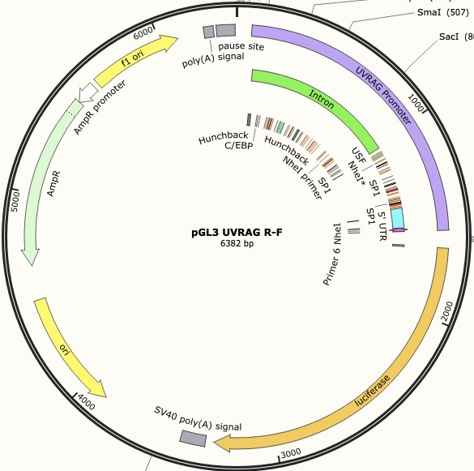

```{r setup, include=FALSE, warning=FALSE}
knitr::opts_chunk$set(echo = TRUE, fig.path = '../Output/')
```

# Introduction 
For my final project, I will be creating a phylogenetic tree based of the promoter region sequence, UVRAG along with twenty species that carry similar conservation of the same promoter region. A phylogenetic tree is a branching diagram or a tree showing the evolutionary relationships among various biological species or other entities based upon similarities and differences in their physical or genetic characteristics. The UV Radiation Resistance Associated Gene (UVRAG) complements the ultraviolet sensitivity of xeroderma pigmentosum group C cells and encodes a protein with a C2 domain. The protein activates the Beclin1-PI(3)KC3 complex, promoting autophagy and suppressing the proliferation and tumorigenicity of human colon cancer cells. Chromosomal aberrations involving this gene are associated with left-right axis malformation and mutations in this gene have been associated with colon cancer. 

# Libraries  
```{r, message=FALSE}
library(phytools) # functions for phylogenetic analysis 
library(ade4) # analysis of ecological data 
library(ape) # analysis of phylogenetics and evolution 
library(adegenet) # Exploratory analysis of genetic and genomic data 
library(phangorn) # Phylogenetic reconstruction and analysis 
library(tidyverse) # Collection of packages 
library(here) # file referencing 
```

# Example using influenza data 

fasta2DNAbin reads in alignments in fasta format and outputs a DNAbin object. This output contains alignments or SNPs. This function is used through the ape package. 
```{r}
dna <- fasta2DNAbin(file="http://adegenet.r-forge.r-project.org/files/usflu.fasta")

dna
```
Read in the annotation file 
```{r}
annot <- read.csv("http://adegenet.r-forge.r-project.org/files/usflu.annot.csv", header=TRUE, row.names=1)
annot
```
## Using a Distance-based method phylogeny 

Distance-based methods are produced calculating the genetic distances between pairs of taxa, followed by hierarchial clustering.

### Step 1
```{r distanceflu, fig.align='center'}
D <- dist.dna(dna, model = "TN93") #TN93 type of evolutionary model being used. This one allows for different transition rates, heterogenous base frequencies, and variation of substitution rate at the same site
length(D) #number of pairwise distances, computed as n(n-1)/2

temp <- as.data.frame(as.matrix(D))
table.paint(temp, cleg=0, clabel.row=.5, clabel.col=.5) #darker shades of gray mean a larger distance # 

# Shows a trend or pattern 
```

### Step 2
```{r treeflu, fig.align='center'}
tre <- nj(D) # classic neighbor-joining algorithm 
class(tre) #all trees created using {ape} package will be of class phylo

tre <- ladderize(tre)
tre # tells us what the tree will look like but doesn't show the actual construction

plot(tre, cex = 0.6)
title("A Simple NJ Tree")
```

### Step 3 
Example using a cluster diagram 
```{r clusterflu, fig.align='center'}
# or 
h_cluster <- hclust(D, method = "average", members = NULL) # method = average is used for UPGMA, members can be equal to NULL or a vector with a length of size D
plot(h_cluster, cex = 0.6)
```

# Working with UVRAG promoter region 

Study whether specific Transcription Factor Binding Sites (TFBS) play a role in the regulation and expression of the promoter region. 













```{r FASTA}

UVRAG1 <- fasta2DNAbin(file = here("Data", "MSAs.fas"))

UVRAG1
```


Creating a data frame  
```{r DistDNA, fig.align='center'}
U <- dist.dna(UVRAG1, model = "TN93")
length(U) #number of pairwise distances, computed as n(n-1)/2


temp1 <- as.data.frame(as.matrix(U)) 

```

## Creating a phylogenetic tree using the UVRAG promoter region 
```{r UVRAGtree, fig.align='center', warning=FALSE}
# Creating tree 
tree <- fastme.bal(U) # had to use fastme based off of fasta data. minimum evolution algorithm 
class(tree) #all trees created using {ape} package will be of class phylo

tree <- ladderize(tree)
tree # tells us what the tree will look like but doesn't show the actual construction

plot(tree, cex = 0.6) 
title("Conservation of UVRAG Promoter")
```

The Homo Sapiens share similar conservation with *Peromyscus maniculatus*. Each node depicts the similar common ancestor of the species. Although This is preliminary data and is subject to change as further research is conducted on the promoter region but is a good starting point leading to possible further directions when studying the putative promoter region. 

#### Using the data from the UVRAG promoter to create an unrooted tree
```{r unrootedtree, fig.align='center', warning=FALSE}

plot(unroot(tree),type="unrooted",no.margin=TRUE,lab4ut="axial",
    edge.width=2)


```

<center>

